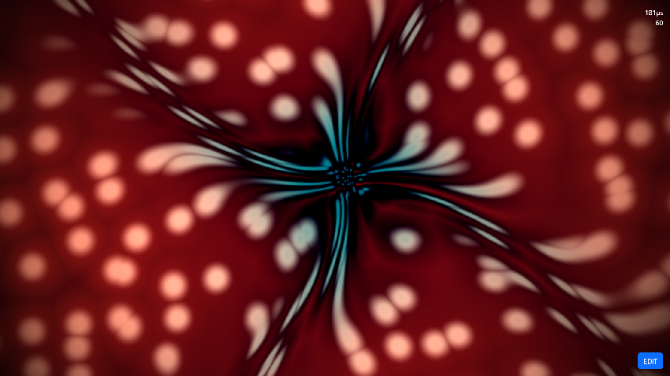
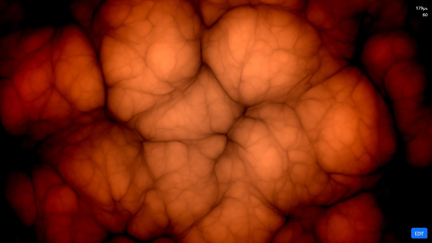
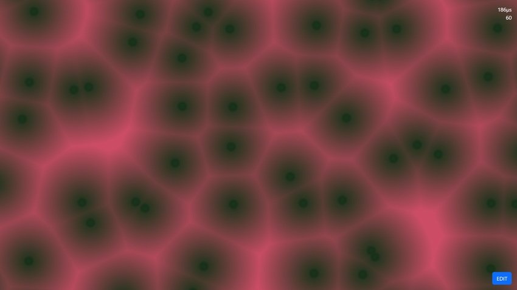
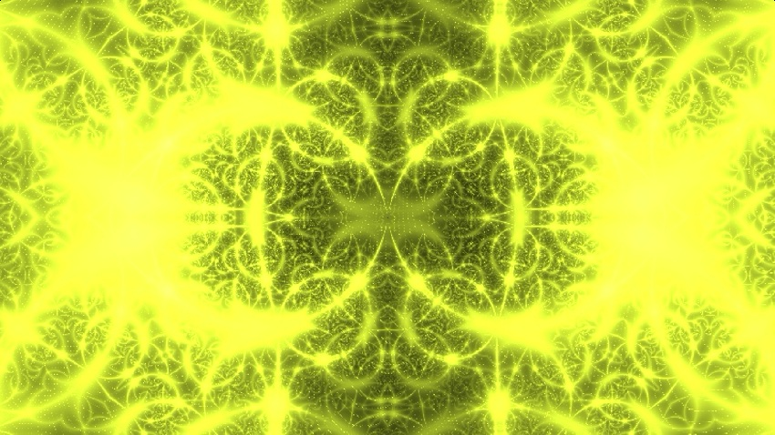
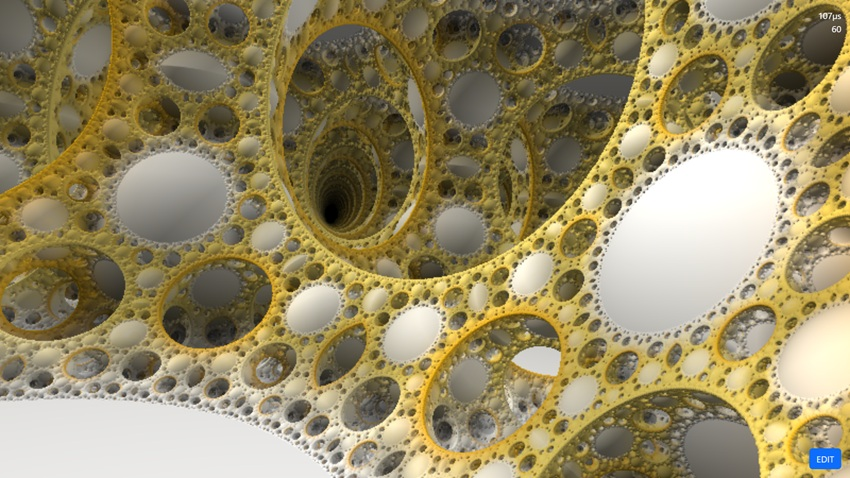
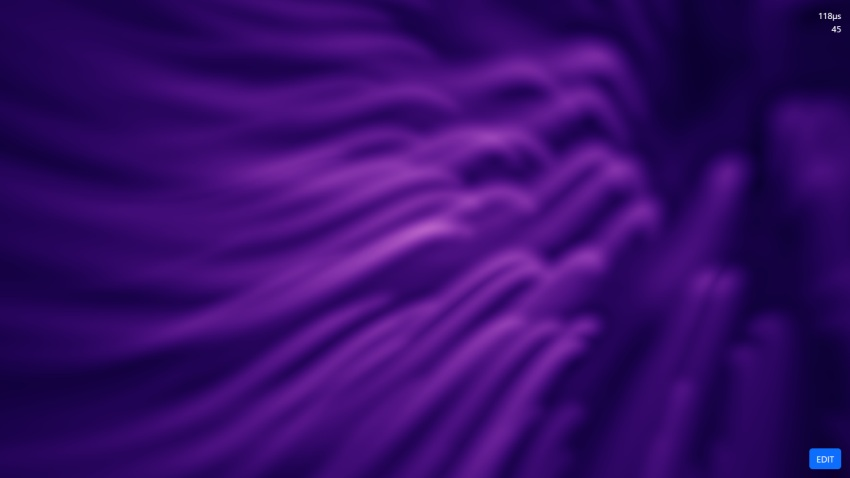
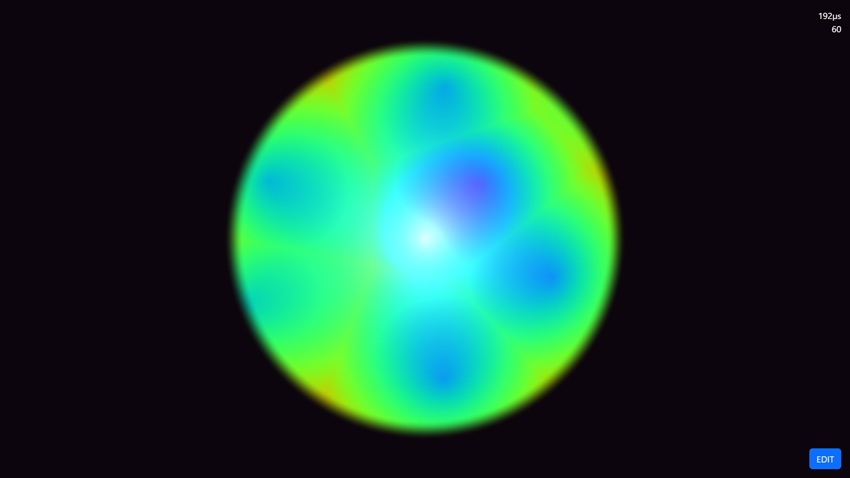

# The Architect of Constraints: Revealing Life in WGSL
_From 1990s Plasma to Emergent Biomimicry._


>Transparency: Textual refinement and code commenting were assisted by AI. All underlying logic, architecture, and original writing are by Magnus Thor, except where specific external inspirations or credits are noted within the text.

## Prologue: From 1992 to the GPU

Here’s a revised version that shifts the focus away from _organic synthesis_ as the starting point and instead emphasizes your gradual evolution—from simple demoscene effects to today’s shaders—while keeping the narrative arc intact and personal:

----------

My journey didn’t begin with modern shaders or parallel compute—it began in the early 1990s, glowing softly on the phosphors of retro hardware. At twelve years old, I stumbled upon a copy of Benoit Mandelbrot’s _The Fractal Geometry of Nature_. It felt less like a mathematics book and more like a glimpse behind the curtain of reality itself. _(Thanks to librarian Agneta Prokèn for ordering it to the library in my hometown, Junsele.)_

By 1992, while the demoscene was pushing 8-bit machines far beyond their intended limits, I was writing my first plasma effects and Sierpinski fractals—tiny experiments in complexity for Goatland by Noice on the C64. We weren’t thinking in terms of “rendering pipelines” or “shaders.” We were simply exploring what happened when you combined tight loops, lookup tables, and bit shifts in just the right way. The magic came from doing more with less.

Over the years, both the machines and I grew more capable. Fixed-function graphics gave way to programmable pipelines, CPUs gave way to GPUs, and experimentation gradually moved from cycle-counting tricks to higher-level abstractions—without ever losing that original curiosity: _what kinds of structure can emerge from simple rules?_

Much later, I revisited Alan Turing’s 1952 paper, _The Chemical Basis of Morphogenesis_. Turing described how complex biological patterns—spots, stripes, branching forms—could emerge from the interaction of very simple systems. Reading it, I realized this wasn’t a departure from what I’d been doing since the demoscene days; it was the same idea, expressed in biological terms.

This blog post sits at that intersection. It connects early demoscene thinking—minimal rules, maximal emergence—with modern GPU programming in **WebGPU Shading Language (WGSL)**. Today, we’re no longer constrained by CPU cycles or fixed-function hardware. We can treat the screen as a dynamic field, where patterns evolve, interact, and stabilize according to simulated laws.

The geometry you see isn’t modeled—it _emerges_. And in many ways, that’s the same fascination that started with a flickering plasma effect on a C64 screen more than thirty years ago.



>Christmas Candy Cane Effect- [run it here](  
https://magnusthor.github.io/demolished-live-code/public/?shader=7da1befc-cf04-4631-abcd-1f597cd573d3)

## Abstract

The synthesis of organic-mimetic structures in real-time computer graphics necessitates a departure from traditional Euclidean primitives and explicit mesh-based modeling. Instead, complexity emerges from stochastic fields, recursive mappings, and continuous domain transformations. This article examines biological form through the lens of the WebGPU Shading Language (WGSL), framing life-like appearance not as simulation, but as the visual consequence of physical and mathematical constraints. By progressing from domain warping and cellular partitioning to space folding, volumetric integration, and optical interference, we demonstrate how organic complexity can be _induced_ rather than constructed.

A unifying premise underlies all presented techniques: **geometry is not modeled — it is revealed**.

----------

## 1. Domain Warping

### Viscous Deformation: Higher-Order Function Composition

Domain warping is a technique in which the domain of a function ( f ) is perturbed by another function ( g ). This methodology was formalized by Inigo Quilez in his in my mind [seminal work on Domain Warping](https://iquilezles.org/articles/warp/), demonstrating how nested functional composition transforms static noise into fluid, organic motion:

  
$$
f(p) = g(p + h(p))
$$  


In this implementation, an iterative rotation matrix combined with radial modulation produces non-uniform shear forces across the sampling domain.

**Mechanical Interpretation:** Visualize the coordinate plane as a malleable rubber sheet. By twisting and stretching this sheet, we simulate viscous flow, metabolic drift, and plasma-like deformation found in biological tissues.




### Domain Warping WGSL

```rust
struct Uniforms { resolution: vec3<f32>, time: f32 };
@group(0) @binding(0) var<uniform> uniforms: Uniforms;

fn rotate2D(r: f32) -> mat2x2<f32> {
    let c = cos(r); let s = sin(r);
    return mat2x2<f32>(c, s, -s, c);
}

fn mainImage(invocation_id: vec2<f32>) -> vec4<f32> {
    let uv = (invocation_id - 0.5 * uniforms.resolution.xy) / uniforms.resolution.y;
    var n = vec2<f32>(0.0); var q = vec2<f32>(0.0); var p = uv;
    let d = dot(p, p); var S: f32 = 12.0; var a: f32 = 0.0;
    let m = rotate2D(5.0);

    for (var j: f32 = 0.0; j < 20.0; j += 1.0) {
        p = m * p; n = m * n;
        q = p * S + uniforms.time * 4.0 + sin(uniforms.time * 4.0 - d * 6.0) * 0.8 + j + n;
        a += dot(cos(q) / S, vec2<f32>(0.2));
        n -= sin(q); S *= 1.2;
    }
    return vec4<f32>(vec3<f32>(4.0, 2.0, 1.0) * (a + 0.2) + a + a - d, 1.0);
}

```
**Playground:**  
– WebGPU / WGSL demo: https://magnusthor.github.io/demolished-live-code/public/preview/?shader=8bb074f5-cbf8-41e7-877d-a72971b86976   


## 2. Voronoi Tessellation

### Discrete Spatial Partitioning: Contact Inhibition

[Voronoi diagrams](https://en.wikipedia.org/wiki/Voronoi_diagram) represent a solution to the nearest-neighbor problem by partitioning space into regions of influence. In shader aesthetics, this approach was refined by [Shane](https://www.shadertoy.com/user/shane), introducing jittered lattices and pseudo-random nuclei.

Mathematically, the diagram is computed with constant-time neighborhood evaluation, while an exponential decay models intracellular density:

$$E(d) = e^{-\alpha d}$$

**Mechanical Interpretation:** This mimics contact inhibition in biological cells, where expansion halts upon encountering neighbors.




### Voronoi Tessellation WGSL

```rust
fn hash22(p: vec2<f32>) -> vec2<f32> {
    var p3 = fract(vec3<f32>(p.xyx) * vec3<f32>(0.1031, 0.1030, 0.0973));
    p3 += dot(p3, p3.yzx + 33.33);
    return fract((p3.xx + p3.yz) * p3.zy);
}

fn mainImage(invocation_id: vec2<f32>) -> vec4<f32> {
    let uv = (invocation_id - 0.5 * uniforms.resolution.xy) / uniforms.resolution.y;
    let p = uv * 5.0; let i_p = floor(p); let f_p = fract(p);
    var min_dist: f32 = 1.0; var nucleus: f32 = 0.0;

    for (var y: f32 = -1.0; y <= 1.0; y += 1.0) {
        for (var x: f32 = -1.0; x <= 1.0; x += 1.0) {
            let neighbor = vec2<f32>(x, y);
            var point = hash22(i_p + neighbor);
            point = 0.5 + 0.5 * sin(uniforms.time + 6.2831 * point);
            let dist = length(neighbor + point - f_p);
            min_dist = min(min_dist, dist);
            nucleus += exp(-40.0 * dist);
        }
    }
    let wall = smoothstep(0.05, 0.1, min_dist);
    let final_col = (vec3(0.8, 0.3, 0.4) * min_dist + vec3(0.2, 0.05, 0.1) * nucleus) * wall;
    return vec4<f32>(final_col + vec3(0.1, 0.2, 0.1) * (1.0 - min_dist), 1.0);
}

```

**Playground:**  
– WebGPU / WGSL demo: https://magnusthor.github.io/demolished-live-code/public/preview/?shader=63f05f22-8d8c-42a5-a891-3004bf663828 


## 3. Space-Folding

### Recursive Morphogenesis: Physarum Polycephalum

Rather than [agent-based simulation,](https://en.wikipedia.org/wiki/Agent-based_model) branching networks are generated via [inversion geometry](https://en.wikipedia.org/wiki/Inversive_geometry) — a conformal mapping that folds infinite space into recursive interiors:

$$ p' = \frac{|p|}{|p|^2}  $$

Vein isolation emerges through exponential attenuation relative to transformed axes, producing thin, protoplasmic strands.

**Mechanical Interpretation:** This is mathematical origami — folding, stretching, and rotating space to induce organic topology.




###  Slime Mold Growth WGSL (Compute)

```rust
struct Uniforms {
  resolution: vec3<f32>,
  time: f32
};

@group(0) @binding(0) var<uniform> uniforms: Uniforms;
@group(0) @binding(1) var linearSampler: sampler;
@group(0) @binding(2) var outputTexture: texture_storage_2d<bgra8unorm, write>;

fn hash2(p: vec2<f32>) -> vec2<f32> {
    var p3 = fract(vec3<f32>(p.xyx) * vec3<f32>(0.1031, 0.1030, 0.0973));
    p3 += dot(p3, p3.yzx + 33.33);
    return fract((p3.xx + p3.yz) * p3.zy);
}

@compute @workgroup_size(8, 8, 1)
fn main(@builtin(global_invocation_id) invocation_id: vec3u) {
    let R = vec2<f32>(uniforms.resolution.xy);
    let uv = (vec2<f32>(invocation_id.xy) - 0.5 * R) / R.y;
    let time = uniforms.time;

    var p = uv * 2.5;
    var mold: f32 = 0.0;
    var complexity: f32 = 1.0;

    for (var i: i32 = 0; i < 8; i++) {
        p = abs(p) / dot(p, p) - 0.8;
        let ang = 0.2 + time * 0.05;
        let s = sin(ang); let c = cos(ang);
        p = vec2<f32>(p.x * c - p.y * s, p.x * s + p.y * c);
        let vein = exp(-5.0 * abs(p.y));
        mold += vein / complexity;
        complexity *= 1.2;
    }

    let base_dark = vec3<f32>(0.02, 0.03, 0.01);
    let slime_yellow = vec3<f32>(0.9, 0.95, 0.2);
    let pulse = 0.8 + 0.2 * sin(time * 2.0 + uv.x * 5.0);
    var col = mix(base_dark, slime_yellow, mold * pulse);
    let spores = pow(hash2(uv + floor(time * 10.0)).x, 50.0) * 0.5;
    col += spores * slime_yellow;

    textureStore(outputTexture, invocation_id.xy, vec4<f32>(col, 1.0));
}

```
**Playground:**  
– WebGPU / WGSL demo: https://magnusthor.github.io/demolished-live-code/public/preview/?shader=e7412b93-92fc-4a8d-8ded-be0cebac4436


## 4. Apollonian Gaskets

Apollonian gaskets represent the **crystalline limit of space folding**. Through repeated reflection and inversion, infinite tangent spheres emerge from a compact domain, compressing unbounded space into a finite volume.

Unlike stochastic or noise-driven systems, Apollonian structures are entirely deterministic. Every surface arises from strict geometric constraint rather than randomness, placing them closer to mineral growth, viral capsids, and crystalline packing than to cellular or fluid processes.

At the mathematical core lies **inversion geometry**:

$$
p' = \frac{p}{\lVert p \rVert^2}
$$


Each iteration folds distant space inward while preserving angular relationships. As scale collapses recursively, increasingly fine structure is revealed without introducing new geometry. Detail is not added — it is _uncovered_.

**Mechanical interpretation:** a house of mirrors — space reflecting into itself, filling every interstitial gap with structure. What appears organic is, in fact, the inevitable outcome of perfect symmetry under extreme constraint.



### Apollonian Gaskets WGSL

The following is a WGSL implementation of an **Apollonian gasket**, adapted from work by Inigo Quilez. The original GLSL version can be found on ShaderToy: 
[https://www.shadertoy.com/view/4ds3zn](https://www.shadertoy.com/view/4ds3zn)

```rust
// orbit trap (global mutable, like GLSL)
var<private> orb: vec4<f32>;

fn map(p_in: vec3<f32>, s: f32) -> f32 {
    var p = p_in;
    var scale: f32 = 1.0;

    orb = vec4<f32>(1000.0);

    for (var i = 0; i < 8; i = i + 1) {
        p = -1.0 + 2.0 * fract(0.5 * p + 0.5);

        let r2 = dot(p, p);
        orb = min(orb, vec4<f32>(abs(p), r2));

        let k = s / r2;
        p *= k;
        scale *= k;
    }

    return 0.25 * abs(p.y) / scale;
}

fn trace(ro: vec3<f32>, rd: vec3<f32>, s: f32) -> f32 {
    let maxd: f32 = 30.0;
    var t: f32 = 0.01;

    for (var i = 0; i < 512; i = i + 1) {
        let precis = 0.001 * t;
        let h = map(ro + rd * t, s);

        if (h < precis || t > maxd) {
            break;
        }
        t += h;
    }

    if (t > maxd) {
        return -1.0;
    }
    return t;
}

fn calcNormal(pos: vec3<f32>, t: f32, s: f32) -> vec3<f32> {
    let precis = 0.001 * t;

    let e1 = vec3<f32>( 1.0, -1.0, -1.0) * precis;
    let e2 = vec3<f32>(-1.0, -1.0,  1.0) * precis;
    let e3 = vec3<f32>(-1.0,  1.0, -1.0) * precis;
    let e4 = vec3<f32>( 1.0,  1.0,  1.0) * precis;

    return normalize(
        e1 * map(pos + e1, s) +
        e2 * map(pos + e2, s) +
        e3 * map(pos + e3, s) +
        e4 * map(pos + e4, s)
    );
}

fn render(ro: vec3<f32>, rd: vec3<f32>, anim: f32) -> vec3<f32> {
    var col = vec3<f32>(0.0);
    let t = trace(ro, rd, anim);

    if (t > 0.0) {
        let tra = orb;
        let pos = ro + t * rd;
        let nor = calcNormal(pos, t, anim);

        // lighting
        let light1 = normalize(vec3<f32>( 0.577, 0.577, -0.577));
        let light2 = normalize(vec3<f32>(-0.707, 0.000,  0.707));

        let key = clamp(dot(light1, nor), 0.0, 1.0);
        let bac = clamp(0.2 + 0.8 * dot(light2, nor), 0.0, 1.0);
        let amb = 0.7 + 0.3 * nor.y;
        let ao  = pow(clamp(tra.w * 2.0, 0.0, 1.0), 1.2);

        var brdf = vec3<f32>(0.40) * amb * ao;
        brdf += vec3<f32>(1.00) * key * ao;
        brdf += vec3<f32>(0.40) * bac * ao;

        // material
        var rgb = vec3<f32>(1.0);
        rgb = mix(rgb, vec3<f32>(1.0, 0.80, 0.20), clamp(6.0 * tra.y, 0.0, 1.0));
        rgb = mix(rgb, vec3<f32>(1.0, 0.55, 0.00),
                  pow(clamp(1.0 - 2.0 * tra.z, 0.0, 1.0), 8.0));

        col = rgb * brdf * exp(-0.2 * t);
    }

    return sqrt(col);
}

fn mainImage(fragCoord: vec2<f32>) -> vec4<f32> {
    let R = uniforms.resolution.xy;
    let time = uniforms.time;

    let anim = 1.1 + 0.5 * smoothstep(-0.3, 0.3, cos(0.1 * time));

    let p = (2.0 * fragCoord - R) / R.y;

    let t = time * 0.25;

    // camera
    let ro = vec3<f32>(
        2.8 * cos(0.1 + 0.33 * t),
        0.4 + 0.30 * cos(0.37 * t),
        2.8 * cos(0.5 + 0.35 * t)
    );

    let ta = vec3<f32>(
        1.9 * cos(1.2 + 0.41 * t),
        0.4 + 0.10 * cos(0.27 * t),
        1.9 * cos(2.0 + 0.38 * t)
    );

    let roll = 0.2 * cos(0.1 * t);

    let cw = normalize(ta - ro);
    let cp = vec3<f32>(sin(roll), cos(roll), 0.0);
    let cu = normalize(cross(cw, cp));
    let cv = normalize(cross(cu, cw));

    let rd = normalize(p.x * cu + p.y * cv + 2.0 * cw);

    let col = render(ro, rd, anim);
    return vec4<f32>(col, 1.0);
}

@fragment
fn main_fragment(in: VertexOutput) -> @location(0) vec4<f32> {
    return mainImage(in.pos.xy);
}


```

**Playground:**  
– WebGPU / WGSL demo: https://magnusthor.github.io/demolished-live-code/public/preview/?shader=b98abdd6-086c-4634-89f7-7316d4220637    


## 5. Volumetric Raymarched Voronoi

This section removes the notion of surface entirely. Structure is no longer defined by boundaries, but by a continuous scalar field sampled through space. Form emerges from **accumulated density**, not geometry.

Voronoi distance is used as an organizing signal rather than a partition. Cellular influence is expressed through exponential falloff, producing soft compartments without explicit borders.

### Density Field Construction

The volume density combines three constraints:

$$
\rho(p) = e^{-6v(p)} \cdot \sin(t + 10v(p)) \cdot e^{-0.5 \lVert p \rVert^2}
$$


where $v(p)$ is Voronoi distance evaluated in a warped domain. Time modulation introduces pulsation, while radial decay bounds the structure without clipping.

### Raymarched Integration

Rendering proceeds by stepping along a ray and accumulating density:

$$
G = \sum_i \rho(p_i)\,\Delta t
$$


This approximates volumetric emission and absorption. Color is derived directly from accumulated density, producing depth and translucency without surfaces, normals, or lights.

**Mechanical Interpretation:** This system models matter before form. Nothing is simulated, animated, or enclosed. Motion arises from domain deformation rather than object movement. Like many inorganic substrates essential to life, the volume is passive yet decisive: it does not encode biology, but it defines the space in which biology becomes possible.




```rust
 fn hash22(p: vec2<f32>) -> vec2<f32> {
    var p3 = fract(vec3<f32>(p.xyx) * vec3<f32>(0.1031, 0.1030, 0.0973));
    p3 += dot(p3, p3.yzx + 33.33);
    return fract((p3.xx + p3.yz) * p3.zy);
}

fn voronoi(p: vec2<f32>) -> f32 {
    let n = floor(p);
    let f = fract(p);
    var md = 8.0;
    for (var j = -1.0; j <= 1.0; j += 1.0) {
        for (var i = -1.0; i <= 1.0; i += 1.0) {
            let g = vec2(i, j);
            var o = hash22(n + g);
            o = 0.5 + 0.5 * sin(uniforms.time + 6.2831 * o);
            let r = g + o - f;
            let d = dot(r, r);
            if (d < md) {
                md = d;
            }
        }
    }
    return sqrt(md);
}

fn density(p: vec3<f32>, time: f32) -> f32 {
    // Domain warp the sampling space
    let warp = sin(p.yzx * 1.5 + time) * 0.25;
    let q = p + warp;
    
    // Cellular density
    let v = voronoi(q.xy * 2.0);
    let cell = exp(-6.0 * v);
    
    // Metabolic pulsation
    let pulse = sin(time * 2.0 + v * 10.0) * 0.5 + 0.5;
    
    // Proximity falloff (keep the "organism" contained)
    let falloff = exp(-0.5 * dot(p, p));
    
    return cell * pulse * falloff;
}

fn raymarch(ro: vec3<f32>, rd: vec3<f32>, time: f32) -> vec3<f32> {
    var t = 0.0;
    var glow = 0.0;
    
    // Step through the volume
    for (var i = 0; i < 80; i++) {
        let p = ro + rd * t;
        let d = density(p, time);
        
        // Accumulate density (Beer-Lambert approximation)
        glow += d * 0.04;
        
        t += 0.06;
        if (t > 5.0) { break; }
    }
    
    // Bioluminescent color mapping
    let color = vec3<f32>(
        glow * 1.4,         // Red
        pow(glow, 2.0),     // Green 
        pow(glow, 0.5)      // Blue (Translucency)
    );
    
    return color;
}

fn mainImage(fragCoord: vec2<f32>) -> vec4<f32> {
    let res = uniforms.resolution.xy;
    let time = uniforms.time;
    let uv = (2.0 * fragCoord - res) / res.y;

    // Camera setup
    let ro = vec3<f32>(2.0 * sin(time * 0.5), 1.0 * cos(time * 0.3), -3.0);
    let ta = vec3<f32>(0.0, 0.0, 0.0);
    
    let cw = normalize(ta - ro);
    let cu = normalize(cross(cw, vec3(0.0, 1.0, 0.0)));
    let cv = normalize(cross(cu, cw));
    let rd = normalize(uv.x * cu + uv.y * cv + 2.0 * cw);

    let col = raymarch(ro, rd, time);
    
    // Simple tone mapping
    return vec4<f32>(pow(col, vec3(0.4545)), 1.0);
}


```

**Playground:**  
– WebGPU / WGSL demo: https://magnusthor.github.io/demolished-live-code/public/preview/?shader=b9d5f247-0d26-4b82-9911-424d7301f0cd


## 6. Inorganic Substrates

### Constraint Fields That Enable Life

Life does not arise in isolation. Water, minerals, and crystalline lattices form the physical constraints through which organic complexity becomes inevitable. In this section, we transition from the "soft" logic of cells to the "hard" logic of the environments that host them.

### 6.A Water — Flow Without Intent

Water minimizes resistance. Computationally, this manifests as divergence-free flow fields and advection. By using a **Curl Noise** derivation, we ensure that the "water" flows in continuous loops without sinking into single points, mimicking the behavior of non-compressible fluids.

```rust
fn water_flow(p: vec2<f32>, time: f32) -> vec2<f32> {
    let e = 0.01;
    let n1 = snoise(vec3(p.x, p.y + e, time));
    let n2 = snoise(vec3(p.x, p.y - e, time));
    let n3 = snoise(vec3(p.x + e, p.y, time));
    let n4 = snoise(vec3(p.x - e, p.y, time));
    // The Curl: Partial derivatives create rotational force
    return vec2<f32>(n1 - n2, n4 - n3); 
}

```

### 6.B Carbon — Stored Complexity

Carbon is inert history—recursive density reservoirs that bias emergence. We represent this via **Fractal Brownian Motion (fBm)**, where multiple layers of noise are octaved to create a stable, rugged landscape that provides "niche" spaces for organic growth.

```rust
fn carbon_substrate(p: vec2<f32>) -> f32 {
    var v = 0.0; var a = 0.5; var q = p;
    for (var i = 0; i < 6; i++) {
        v += a * snoise(vec3(q, 0.0));
        q *= 2.0; a *= 0.5;
    }
    return v; // Static, complex foundation
}

```

### 6.C Silicon — Logic Without Life

Crystalline repetition provides rigid scaffolding. Unlike the "jittered" logic of Voronoi, Silicon substrates use **perfect symmetry** and snapping functions to represent the unyielding lattice of a mineral.

```rust
fn silicon_lattice(p: vec2<f32>) -> f32 {
    let grid = sin(p * 10.0);
    let lattice = smoothstep(0.9, 1.0, max(grid.x, grid.y));
    return lattice; // Cubic crystal structure
}

```

### 6.D Optical Emergence — Thin Film Interference

Color need not be material. **Thin-film interference** produces iridescence through phase alone, dominating the visual signature of living membranes like soap bubbles or beetle shells.




```rust

    
fn hash2(p: vec2<f32>) -> vec2<f32> {
    let q = vec2<f32>(
        dot(p, vec2<f32>(127.1, 311.7)),
        dot(p, vec2<f32>(269.5, 183.3))
    );
    return fract(sin(q) * 43758.5453);
}

// Voronoi to create "Bumps" or "Micro-structures" on the shell
fn voronoi(p: vec2<f32>) -> f32 {
    let g = floor(p);
    let f = fract(p);
    var d = 10.0;
    for (var y = -1; y <= 1; y++) {
        for (var x = -1; x <= 1; x++) {
            let o = vec2<f32>(f32(x), f32(y));
            let h = hash2(g + o);
            let r = o + h - f;
            d = min(d, dot(r, r));
        }
    }
    return sqrt(d);
}

fn mainImage(invocation_id: vec2<f32>) -> vec4<f32> {
    let iResolution = uniforms.resolution.xy;
    let iTime = uniforms.time;
    let uv = (invocation_id - 0.5 * iResolution) / iResolution.y;

    // 1. Create a "Pod" shape
    let d = length(uv);
    let shell_mask = smoothstep(0.4, 0.38, d);

    // 2. Generate Surface Normal (the "Bumps")
    // We sample Voronoi and shift it over time to simulate a shimmering surface
    let v_uv = uv * 3.0;
    let val = voronoi(v_uv + iTime * 0.1);
    
    // 3. Thin-Film Interference Math
    // We calculate 3 color channels with different phase shifts.
    // The "thickness" of the film is modulated by the distance 'd' and the voronoi 'val'.
    let thickness = d * 5.0 + val * 2.5;
    
    // spectral shift: RGB phases are offset by 0.0, 2.0, and 4.0
    let r = 0.5 + 0.5 * cos(thickness + 0.0 + iTime);
    let g = 0.5 + 0.5 * cos(thickness + 2.0 + iTime);
    let b = 0.5 + 0.5 * cos(thickness + 4.0 + iTime);
    
    var color = vec3<f32>(r, g, b);

    // 4. Add "Specular" Highlight
    // This makes it look like a shiny, wet organic surface
    let specular = pow(1.0 - d, 10.0) * 0.8;
    color += specular;

    // 5. Final Mask and Background
    let final_rgb = color * shell_mask + (1.0 - shell_mask) * vec3<f32>(0.05, 0.02, 0.05);

    return vec4<f32>(final_rgb, 1.0);
}


@fragment
fn main_fragment(in: VertexOutput) -> @location(0) vec4<f32> {      

	return mainImage(in.pos.xy);
	
}


```


## 7. Temporal Foundations: Overcoming Sampling Jitter

In the demoscene of the 90s, we fought the refresh rate of CRTs; on the GPU, we battle the Nyquist-Shannon limit of the time variable. High-frequency oscillations — like the rapid shimmering of thin-film interference — can appear to strobe or jitter when the frame rate is insufficient.

To achieve truly organic fluidity, we must introduce **temporal inertia**. Real-world materials cannot react instantaneously to force; they “remember” previous states. Similarly, in shaders, motion must be smoothed over time to avoid aliasing artifacts, especially when combining multiple oscillatory effects.

### Conceptual Temporal Low-Pass Filtering

A mathematically rigorous temporal low-pass filter blends the current frame with past frames:

$$  
y_t = (1-\alpha) y_{t-1} + \alpha x_t  
$$

where (x_t) is the input signal (e.g., time-based noise) and (\alpha) controls the inertia. This is the principle behind **temporal anti-aliasing (TAA)** in production graphics.

For illustrative purposes in WGSL, we can implement a **conceptual inertia function** that smooths high-frequency motion without relying on frame history:

```rust
// Conceptual temporal inertia
fn inertial_time(t: f32, inertia: f32) -> f32 {
    // Two frequencies are blended to mimic temporal smoothing
    let fast = sin(t);          // rapid oscillation
    let slow = sin(t * 0.5) * 0.5 + 0.5;  // slower, weighted baseline
    return mix(fast, slow, inertia);      // inertia ∈ [0,1]
}

```

This function does **not** strictly track previous frames but demonstrates the effect: motion appears “thick,” purposeful, and free from high-frequency strobing. Coupled with spatial noise and procedural deformation, it transforms clinical digital motion into fluid, viscous animation.

**Mechanical Interpretation:** Think of it as giving the shader world **mass and memory**. Structures do not instantly snap to new configurations; they “flow” through time, retaining the impression of weight. Temporal smoothing is therefore as essential to organic perception as domain warping is to spatial emergence. By blending spatial complexity with temporal inertia, we move from the precise, discrete steps of a CPU clock to a continuous, living field — a subtle but powerful step toward rendering life-like behavior without simulating life itself.


## 8.Principles of Emergent Form


Having explored domain warping, Voronoi tessellation, space folding, and volumetric integration, we can distill the principles that govern the emergence of life-like structure in these systems:

1.  **Geometry is folded** – space itself is transformed, twisted, and inverted to reveal hidden structure.
    
2.  **Space is partitioned** – constraints divide the field into domains that guide organization.
    
3.  **Networks emerge** – patterns arise from iterative interaction rather than explicit modeling.
    
4.  **Matter is packed** – density fields and lattices scaffold potential growth.
    
5.  **Density is integrated** – volumetric accumulation gives depth, translucency, and continuity.
    
6.  **Structure is scaffolded** – environmental constraints, noise, and crystalline lattices create the substrate for complexity.
    
7.  **Perception arises** – life-like behavior is not simulated; it is inferred by the observer from emergent order.
    

These steps reveal a subtle but profound insight: **organic complexity is not constructed — it is enabled**. The role of the author shifts from sculptor to curator of constraints. Each line of code, each shader pass, is not a shape, but a rule under which shape is allowed to exist.


## 9. Limitations

These systems model form, not function. They capture the structural essence of biological phenomena without simulating metabolism, growth dynamics, or chemical causality. The resemblance to life is perceptual and aesthetic: patterns look alive because they obey constraints similar to those found in nature, not because they are alive.

In other words: we do not create life; we create the conditions in which life-like structure inevitably appears. This distinction is subtle but essential, preserving both conceptual rigor and the integrity of the artistic experiment.


## 10. Holiday Shader: Candy Cane Domain Warping

As part of the _So You Think You Can Code 2025_ series, here’s a playful experiment combining domain warping and Voronoi tessellation — a festive candy-cane effect for the season. While not organic in the biological sense, it demonstrates the versatility of the techniques discussed above: constraints + transformation = emergent pattern.


– WebGPU / WGSL demo: https://magnusthor.github.io/demolished-live-code/public/preview/?shader=7da1befc-cf04-4631-abcd-1f597cd573d3


## Closing Note

What these experiments demonstrate is not that computers can imitate life — but that **life-like structure is an inevitable consequence of constrained systems**.

From early demoscene plasmas to modern WGSL compute passes, the tools have changed, but the principle has not. When space is folded, when domains are warped, when density is integrated and interference is allowed to accumulate, structure appears without being specified. The role of the author shifts from architect to curator of constraints.

In this sense, the GPU is not a canvas.  
It is a laboratory.

We do not sculpt form directly.  
We define the rules under which form is allowed to exist.

Organic complexity is not constructed.  
It is _revealed_ — through limitation, interaction, and time.


----

Merry Christmas
*Magnus Thor*
